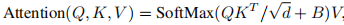

# 摘要

本文介绍了一种称为<font color=red>**Swin Transformer**</font>的新视觉Transformer，它可以作为 CV 的**通用主干**。将 Transformer 从语言适应到视觉方面的挑战来自**两个域之间的差异，例如视觉实体的规模以及相比于文本单词的高分辨率图像像素的巨大差异**。为解决这些差异，<font color=red>**Swin Transformer**</font>提出了一种**层次化 (hierarchical) Transformer**，其表示是用 **移位窗口 (Shifted Windows)** 计算的。移位窗口方案通过将***自注意力计算限制在不重叠的局部窗口的同时，还允许跨窗口连接来提高效率***。这种分层架构具有在各种尺度上建模的灵活性，并且 相对于图像大小具有线性计算复杂度。Swin Transformer 的这些特性使其与广泛的视觉任务兼容，包括图像分类（ImageNet-1K 的 87.3 top-1 Acc）和 密集预测任务，例如 目标检测（COCO test dev 的 58.7 box AP 和 51.1 mask AP）和语义分割（ADE20K val 的 53.5 mIoU）。它的性能在 COCO 上以 +2.7 box AP 和 +2.6 mask AP 以及在 ADE20K 上 +3.2 mIoU 的大幅度超越了 SOTA 技术，证明了基于 Transformer 的模型作为视觉主干的潜力。分层设计和移位窗口方法也证明了其对全 MLP 架构是有益的。

# 1.介绍

CV 建模主要依赖于 CNN。AlexNet在图像分类挑战中的出色表现开启了CNN架构的进化之路，其规模不断扩大，连接更加广泛，卷积形式更为复杂。CNN作为各种视觉任务的核心网络，架构的进步提升了性能，推动了整个领域的发展。然而，NLP领域的网络架构发展则另辟蹊径，<font color=1fc61f>**Transformer**</font>成为主流。<font color=1fc61f>**Transformer**</font>专为序列建模和转换任务而设计，其注意力机制能够有效处理数据中的长程依赖关系，因而声名远扬。它在语言领域的巨大成功，引发了研究人员对其在计算机视觉领域应用的研究，近期在某些任务中已展现出良好的效果，尤其在***图像分类和联合视觉-语言建模***方面。

将<font color=1fc61f>**Transformer**</font>迁移至CV领域是面临显著挑战的，这因为语言领域的高性能与视觉领域具有显著差异，这种差异主要有**两方面**：
1.其中一种差异体现在尺度上。与语言<font color=1fc61f>**Transformer**</font>中作为处理基本单位的**word token**不同，视觉元素的尺度可能存在较大差异，这在目标检测等任务中是一个值得关注的问题。在现有的基于<font color=1fc61f>**Transformer**</font>的模型中，token的尺度是**固定**的，这种特性并**不适用于这些视觉应用**。
2.另一个差异是，**图像中的像素分辨率远高于文本段落中的文字**。还有许多视觉任务，例如语义分割，需要在像素级别进行密集预测，这对于高分辨率图像上的<font color=1fc61f>**Transformer**</font>来说处理难度较大，因为***其自注意力的计算复杂度与图像大小的二次方相关***。


为了解决这些问题，<font color=red>**Swin Transformer**</font>构建了层次化特征图，***其计算复杂度与图像大小呈线性关系***。如图1所示，<font color=red>**Swin Transformer**</font> **从较小尺寸的 patch（灰色轮廓）开始，在更深入的<font color=1fc61f>**Transformer**</font>层中逐渐合并相邻的 patch，从而构建出一个层次化表示**。通过这些层次化特征图，<font color=red>**Swin Transformer**</font>模型可以轻松地应用先进技术进行密集预测，例如特征金字塔网络（FPN）或 U-Net。***线性计算复杂度是通过在图像分区的非重叠窗口内局部计算自注意力来实现的（红色轮廓）（而不是在整张图像的所有 patch 上进行）。每个窗口中的 patch 数量是固定的，因此复杂度与图像大小成线性关系***。这些优势使<font color=red>**Swin Transformer**</font>成为各种视觉任务的通用主干，与之前基于 <font color=1fc61f>**Transformer**</font>的架构形成对比，后者***生成单一分辨率的特征图且具有二次复杂度***。


<font color=red>**Swin Transformer**</font>的一个关键设计要素是它在***连续自注意力层之间的窗口分区的移位（shift)***，如图 2 所示。**移位窗口连接了前一层的窗口，提供了两者之间的联系，显著增强了建模能力**。这种策略对于实际应用中的延迟也很有效：一个局部窗口内的所有查询 patch 共享相同的key集合，这有利于硬件中的内存访问。相比之下，早期基于滑动窗口的自注意力方法，由于不同的查询像素具有不同的key集合，在通用硬件上受到低延迟的影响。我们的实验表明，所提出的移位窗口方法的延迟比滑动窗口方法要低得多，而建模能力相似（见表 5/6）.

<font color=red>**Swin Transformer**</font>在图像分类、目标检测和语义分割等识别任务上表现出色。它在三个任务上的延迟相似的情况下，明显优于**ViT/DeiT 和 ResNe(X)t**等优秀CV模型,它将促进视觉和文本信号的联合建模，并可以更深入地共享来自两个领域的建模知识。

# 2.整体架构


上图展示了<font color=red>**Swin Transformer**</font>的基本架构（tiny版<font color=red>**Swin Transformer**</font>）

* <font color=00bfff>**Patch Partition模块**</font>
  1.首先通过<font color=00bfff>**Patch Partition模块**</font>将输入的维度为${H}\times{W}\times{3}$的GRB图像拆分为**非重叠且尺寸相同的patch**,拆分后整体维度变为${N}\times{({p^2}\times{3})}$，其中：$N$=${HW}\over{p^2}$,代表拆分出来多少个Patch(<font color=1fc61f>**Transformer**</font>的有效输入序列长度)；${p^2}\times{3}$代表每个Patch的维度，每个patch会被延展后作为一个token输入<font color=red>**Swin Transformer**</font>中
  2.具体到上图，$p$被选为4，故将初始维度为${H}\times{W}\times{3}$输入<font color=00bfff>**Patch Partition模块**</font>后，该图像会被拆分为$N$=${HW}\over{4^2}$个形状为$4^2\times3=48$的Patch,将每个Patch展平为48维的token向量（类似于<font color=red>ViT的Flattened Patches</font>），整体是一个展平且维度为$N\times48$的$2D$ patch张量（矩阵）
* <font color=00bfff>**线性嵌入模块（Linear Embedding）**</font>是一个针对于各Patch token的全连接层FC，将经由<font color=00bfff>**Patch Partition模块**</font>所得维度为$N\times48$的张量投影到任意维度*C*,得到维度为$N\times{C}$的<font color=00bfff>(Linear Embedding)</font>
* <font color=00bfff>**Swin Transformer blocks**</font>:Linear Embedding被输入若干具有改进自注意力的<font color=00bfff>**Swin Transformer blocks**</font>。首个<font color=00bfff>**Swin Transformer block**</font>保持输入输出tokens恒为$N$不变，且与<font color=00bfff>**线性嵌入模块（Linear Embedding）**</font>共同被指定为**Stage 1**.
* <font color=00bfff>**层次化表示 (Hierarchical Representation)**</font>：为了产生一个层次化表示，随着网络的加深，Patch tokens数量会被逐渐减小，这一操作通过各Stage的<font color=00bfff>**Patch合并模块(patch meraging)**</font>完成，它在每个Stage前下采样缩小分辨率并减半通道数。
  1.首个Patch合并模块拼接了每组$2\times2$相邻Patch，所以Patch tokens数$N$变为原来的$1\over4$,即为$N$=$H\over8$$\times$$W\over8$.
  2.进而，Patch token的维度扩大4倍，即*4C*。
  3.然后，对*4C*维度的拼接Patch tokens使用了一个线性层，将输出维度将为*2C*
  4.最后，使用<font color=00bfff>**Swin Transformer blocks**</font>进行特征转换，保持其分辨率（token数N）为$H\over8$$\times$$W\over8$不变。
  5.首个<font color=00bfff>**Patch合并模块(patch meraging)**</font>与后面的<font color=00bfff>**Swin Transformer blocks**</font>构成**Stage 2**.
  6.重复2次**Stage 2**,分别指定为**Stage 3**，**Stage 4**，输出分辨率（token数N）分别为$H\over16$$\times$$W\over16$，$H\over32$$\times$$W\over32$.
  7.每个**Stage i**都会改变Patch tokens张量的维度，从而形成一种层次化的表示。

下图分别为：
图1：<font color=00bfff>**Patch合并模块(patch meraging)下采样过程**</font>
图2：<font color=red>**Swin Transformer数据流维度变化**</font>


<div align="center"> <strong>图1</strong> </div><br>


<div align="center"> <strong>图2</strong> </div><br>

# 3.Swin Transformer blocks


* <font color=00bfff>**Swin Transformer block**</font>相比于<font color=00bfff>**Vision Transformer block(ViT)**</font>,将标准多头自注意力模块（MSA，Multi-Head Self Attention）替换为<font color=00bfff>**基于规则/移位窗口的多头自注意力模块** (​**W-MSA / SW-MSA**​)</font>且其他部分保持不变。
* 如图6所示：一个<font color=00bfff>**Swin Transformer block**</font>由前一<font color=00bfff>**基于规则窗口的多头自注意力模块W-MSA**</font>和后一个<font color=00bfff>**基于移位窗口的多头自注意力模块SW-MSA**</font>构成，前后各接一个**LayerNorm(LN)层**，且在后接的LN层后还要接一个应用有**Gelu非线性激活函数**(似乎是NLP领域的当前最佳,尤其在Transformer模型中表现最好)的**两层MLP**（Multilayer Perceptron,多层感知器，包含一系列全连接层和非线性激活函数来对特征进行变换，最终得到一个经过非线性映射的新特征表示)
* 残差链接分别在W—MSA和SW-MSA模块中被分别运用两次

# 4.基于移位窗口的自注意力机制

## 4.1 传统CV版本Transformer复杂度计算

* 基于标准的<font color=1fc61f>**Transformer**</font>架构变化而形成的对图像分类的适应版本，如<font color=1fc61f>**Vision Transformer**</font>架构，都执行<font color=00bfff>**全局自注意力**</font>,即计算了每个token与其他所有tokens之间的注意力得分(**Attention map**),其具有**相对于token数$N$的二次计算复杂度$O(N^2D)$**,$D$为token向量长度/嵌入维度，即上文中$p^2\times{C}$.


* 基于上述计算，当$N>>D$时，$O(MSA)=O(N^2D)$,过于复杂
* 结论：**传统变体不适用与许多需要大量tokens的密集预测/高分辨率图像表示等高计算量视觉问题**

## 4.2 swin Transformer复杂度计算

* 为高效建模，<font color=00bfff>**Swin Transformer block**</font>中以不重叠的方法均匀划分图像得到各个窗口，在<font color=00bfff>**非重叠的局部窗口中计算自注意力**</font>，取代全局注意力
* 已知$D=2C$,我们设**每个非重叠局部窗口都包含$N=M\times{M}$个Patch tokens**,则**基于具有$N=H\times{W}$个patch tokens的图像窗口的MSA模块**和**基于非重叠的规则/移动局部窗口的W-MSA/SW-MSA模块**的计算复杂度分别如下图所示：
  


* 其中
  1.MSA关于Patch tokens数$N=h\times{w}$具有<font color=red>**二次复杂度**</font>$O(MSA)=O(N^2D)=O((hw)^2D)$（<font color=00bfff>**共有$hw$个patch tokens,基于多头自注意力机制，每个token在全局内计算$hw$次,每次要计算$D$个元素相乘**</font>）
  2.W-MSA/SW-MSA，当$M$固定的时候（假设为一个较小的数字），关于Patch tokens数$N=H\times{W}$具有<font color=red>**线性复杂度**</font>$O(W—MSA/SW—MSA)=O((M^2)hwC)$（<font color=00bfff>**共有$hw$个patch tokens,基于非重叠窗口的自注意力机制，每个token在各自的局部窗口内计算$M^2$次,每次要计算$D$个元素相乘**</font>）
* 巨大的$hw$对于全局自注意力的计算是难以承受的，而<font color=red>**基于非重叠的规则/移动局部窗口的自注意力机制（W-MSA/SA-MSA）**</font>具有良好的扩展性

## 4.3 在连续块中的移动窗口划分

* ***基于非重叠的规则局部窗口的自注意力模块 (W-MSA) 虽将计算复杂度从二次降为线性，但跨窗口之间交流与联系的匮乏将限制其建模表征能力***。为引入跨窗口的联系且同时保持非重叠窗口的计算效率，<font color=00bfff>**Swin Transformer**</font>提出一个<font color=red>**移位窗口划分方法**</font>，该方法在连续<font color=00bfff>**Swin Transformer block**</font>中的两种划分/分区配置间交替。

  


* 如图9，首个模块使用<font color=00bfff>**基于非重叠的规则局部窗口的自注意力机制（W-MSA）**</font>,从左上角像素开始，将$8\times8$的图像均匀划分为$2\times2$个大小为$4\times4$的规则窗口（此时$N=16=M\times{M}=4\times4$）
* 然后，第二个模块使用<font color=00bfff>**基于非重叠的移动局部窗口的自注意力机制（SW-MSA）**</font>,令前一层的规则窗口向左上<font color=00bfff>**循环移位（$M\over2$,$M\over2$)**</font>个像素，如图9所示

  

* 通过采用移位窗口划分方法，如图6的**两个连续 Swin Transformer Blocks**的计算可表示为图10,其中$\hat{z}^l$和$z^l$分别表示了第*l*个<font color=00bfff>**Swin Transformer block**</font>的<font color=00bfff>**W-MSA/SA-MSA模块**</font>输出特征和<font color=00bfff>**MLP模块**</font>输出特征

## 4.4 SW-MSA中的masked MSA机制

* 一个关于移动窗口的问题是：用上述策略进行移动后不会产生更多的窗口编号，但**有些属于同一编号窗口的尺寸将小于**$M\times{M}$。一个解决办法是，**将更小的窗口填充至$M\times{M}$，且在计算注意力时masked掉填充值**。当规则划分的窗口数很小的时候，如前文举例的$2\times{2}$，由该朴素方法所带来的计算量增长是相当可观的（$2\times{2}=4\rightarrow 3\times{3}=9$,扩大2.25倍）
* 另一个关于移动窗口的问题是：<font color=00bfff>**在移动窗口后，批窗口所在位置不变，但其内部却可能由特征图中不相邻的子窗口组成**</font>，这可能会导致不同窗口的自注意力计算混合到一起,而<font color=red>我们在计算Attention Map时，希望​**仅留下具有相同index的Query和Key的计算结果**​，而**忽略不同index 的Query和Key的计算结果**</font>。因此，需要采用<font color=00bfff>**masked MSA 机制将自注意力计算限制在各子窗口内，最后通过逆循环移位方法将每个窗口的自注意力结果返回**</font>。通过​合理设置Mask​，可使**Shifted Window Attention(SW-MSA)** 在与**Basic Window Attention(W-MSA)** 窗口个数相同的情况下达到等价的计算结果，如图11所示
  


下面是一个简单的示例：
$\quad$ 首先，对Shift Window后的每个窗口都赋予index，并执行roll操作(window\_size=2, shift\_size=1),如下所示：


$\quad$ 假设窗口大小为$2\times2$,则**图中应共有四个规则窗口**，若在原本的规则窗口中直接进行自注意力计算会使得 5号/3号 子窗口的自注意力计算混在一起，类似的混算还包括 7号/1号 子窗口和 8号/6号/2号/0号 子窗口的纵向或横向等，这些**移动后产生的窗口大多在原规则窗口中不相邻**。所以需采用 **masked MSA 机制**：**先正常计算自注意力，再进行mask操作将不需要的注意力图置0，从而将自注意力计算限制在各子窗口内**。如下图所示：


$\quad$ Value和Query的shape一致(4×1),以上方法计算的shape=(4×4)的Q、K乃至Attention Map与Value相乘时，依然能够得到正确位置的运算结果，即(4×4)·(4×1)=(4×1)。
$\quad$ 而若要在原始的四个窗口下得到正确计算结果，则必须给**Attention Map**加入一个**Mask**(如上图灰色 patch)

# 5.相对位置编码

* 在计算自注意力时，我们在计算相似度的过程中对每个head加入**相对位置编码**，$B\in\mathbb{R^{{M^2}\times{M^2}}}$,如下所示：
  
  
* 其中,$Q,K,V\in\mathbb{R^{{M^2}\times{d}}}$分别为<font color=00bfff>**Query,Key和Value矩阵,*d*为Query/key维度，$M^2$为（局部）窗口内的Patch数**</font>。$Q,K$相乘得到<font color=00bfff>**Attention map**</font>,它的shape=(<font color=1fc61f>**${numWindows}\times{B},numHeads,WindowSize\times{WindowSize},WindowSize\times{WindowSize}$**</font>)。对于<font color=00bfff>**Attention map**</font>,**以不同的像素点作为原点，则各像素点位置/坐标随之变化**，这也是相对位置编码的设计基础
* 因为沿各轴的相对位置均处于[-M+1,M-1]范围内，我们参数化一个更小尺寸的偏置矩阵$\hat{B}\in\mathbb{R^{{2M-1}\times{2M-1}}}$,且$B$中的值均取自$\hat{B}$
* 由前文可以知道，每个非重叠规则局部窗口包含$N=M\times{M}$个patch tokens,假设现在某个局部窗口的$WindowSize=M=2$,那么分别以**左上角像素点和右上角像素点为原点**的**初始相对位置编码**如下图所示：
  
  
* 以上图所展示该窗口中**不同像素点所对应的初始化相对位置编码规则**为基础，我们可以将该窗口中每个像素点都进行初始化，然后展开成为$1D$向量，堆叠到一起后进行一些操作得到最终的**相对位置索引矩阵**，并注册一个不参与网络学习的<font color=00bfff>**relative_position_index**</font>,其作用是<font color=red>**根据最终得到的相对位置索引找到对应的可学习的相对位置编码，并根据相对位置索引矩阵的shape构成**</font><font color=00bfff>**相对位置编码矩阵$B$**</font>，<font color=red>**然后在后续的注意力机制中**</font><font color=00bfff>**与Attention map逐元素相加**</font>
* 需要注意的是，每个局部窗口所得出的<font color=00bfff>**Attention map**</font>与此方法得到的<font color=00bfff>**相对位置索引矩阵**</font>的**shape**是相同的，这也是二者可以逐元素相加的前提

下图是得到**相对位置索引矩阵**方法的示例图：


<div align="center"> <strong>图16</strong> </div>

* 经过实验，使用相对位置编码的效果**显著优于不使用位置编码和使用绝对位置编码**，可以显著改善模型性能。有趣的是，进一步向输入添加**绝对位置编码**却会略微降低性能

# 5.Swin Transformer源码实现

## 5.1 Swin Transformer主体结构

```
class SwinTransformer(nn.Module):
    r""" Swin Transformer
        A PyTorch impl of : `Swin Transformer: Hierarchical Vision Transformer using Shifted Windows`  -
          https://arxiv.org/pdf/2103.14030
    Args:
        img_size (int | tuple(int)): Input image size. Default 224
        patch_size (int | tuple(int)): Patch size. Default: 4
        in_chans (int): Number of input image channels. Default: 3
        num_classes (int): Number of classes for classification head. Default: 1000
        embed_dim (int): Patch embedding dimension. Default: 96
        depths (tuple(int)): Depth of each Swin Transformer layer.
        num_heads (tuple(int)): Number of attention heads in different layers.
        window_size (int): Window size. Default: 7
        mlp_ratio (float): Ratio of mlp hidden dim to embedding dim. Default: 4
        qkv_bias (bool): If True, add a learnable bias to query, key, value. Default: True
        qk_scale (float): Override default qk scale of head_dim ** -0.5 if set. Default: None
        drop_rate (float): Dropout rate. Default: 0
        attn_drop_rate (float): Attention dropout rate. Default: 0
        drop_path_rate (float): Stochastic depth rate. Default: 0.1
        norm_layer (nn.Module): Normalization layer. Default: nn.LayerNorm.
        ape (bool): If True, add absolute position embedding to the patch embedding. Default: False
        patch_norm (bool): If True, add normalization after patch embedding. Default: True
        use_checkpoint (bool): Whether to use checkpointing to save memory. Default: False
    """
 
    def __init__(self, img_size=224, patch_size=4, in_chans=3, num_classes=1000,
                 embed_dim=96, depths=[2, 2, 6, 2], num_heads=[3, 6, 12, 24],
                 window_size=7, mlp_ratio=4., qkv_bias=True, qk_scale=None,
                 drop_rate=0., attn_drop_rate=0., drop_path_rate=0.1,
                 norm_layer=nn.LayerNorm, ape=False, patch_norm=True,
                 use_checkpoint=False, **kwargs):
        super().__init__()
 
        self.num_classes = num_classes
        self.num_layers = len(depths)
        self.embed_dim = embed_dim
        self.ape = ape
        self.patch_norm = patch_norm
        self.num_features = int(embed_dim * 2 ** (self.num_layers - 1))
        self.mlp_ratio = mlp_ratio
 
        # split image into non-overlapping patches
        self.patch_embed = PatchEmbed(
            img_size=img_size, patch_size=patch_size, in_chans=in_chans, embed_dim=embed_dim,
            norm_layer=norm_layer if self.patch_norm else None)
        num_patches = self.patch_embed.num_patches
        patches_resolution = self.patch_embed.patches_resolution
        self.patches_resolution = patches_resolution
 
        # absolute position embedding
        if self.ape:
            self.absolute_pos_embed = nn.Parameter(torch.zeros(1, num_patches, embed_dim))
            trunc_normal_(self.absolute_pos_embed, std=.02)
 
        self.pos_drop = nn.Dropout(p=drop_rate)
 
        # stochastic depth
        dpr = [x.item() for x in torch.linspace(0, drop_path_rate, sum(depths))]  # stochastic depth decay rule
 
        # build layers
        self.layers = nn.ModuleList()
        for i_layer in range(self.num_layers):
            layer = BasicLayer(dim=int(embed_dim * 2 ** i_layer),
                               input_resolution=(patches_resolution[0] // (2 ** i_layer),
                                                 patches_resolution[1] // (2 ** i_layer)),
                               depth=depths[i_layer],
                               num_heads=num_heads[i_layer],
                               window_size=window_size,
                               mlp_ratio=self.mlp_ratio,
                               qkv_bias=qkv_bias, qk_scale=qk_scale,
                               drop=drop_rate, attn_drop=attn_drop_rate,
                               drop_path=dpr[sum(depths[:i_layer]):sum(depths[:i_layer + 1])],
                               norm_layer=norm_layer,
                               downsample=PatchMerging if (i_layer < self.num_layers - 1) else None,
                               use_checkpoint=use_checkpoint)
            self.layers.append(layer)
 
        self.norm = norm_layer(self.num_features)
        self.avgpool = nn.AdaptiveAvgPool1d(1)
        self.head = nn.Linear(self.num_features, num_classes) if num_classes > 0 else nn.Identity()
 
        self.apply(self._init_weights)
 
    def _init_weights(self, m):
        if isinstance(m, nn.Linear):
            trunc_normal_(m.weight, std=.02)
            if isinstance(m, nn.Linear) and m.bias is not None:
                nn.init.constant_(m.bias, 0)
        elif isinstance(m, nn.LayerNorm):
            nn.init.constant_(m.bias, 0)
            nn.init.constant_(m.weight, 1.0)
 
    @torch.jit.ignore
    def no_weight_decay(self):
        return {'absolute_pos_embed'}
 
    @torch.jit.ignore
    def no_weight_decay_keywords(self):
        return {'relative_position_bias_table'}
 
    def forward_features(self, x):
        x = self.patch_embed(x)
        if self.ape:
            x = x + self.absolute_pos_embed
        x = self.pos_drop(x)
 
        for layer in self.layers:
            x = layer(x)
 
        x = self.norm(x)  # B L C
        x = self.avgpool(x.transpose(1, 2))  # B C 1
        x = torch.flatten(x, 1)
        return x
 
    def forward(self, x):
        x = self.forward_features(x)
        x = self.head(x)
        return x
 
    def flops(self):
        flops = 0
        flops += self.patch_embed.flops()
        for i, layer in enumerate(self.layers):
            flops += layer.flops()
        flops += self.num_features * self.patches_resolution[0] * self.patches_resolution[1] // (2 ** self.num_layers)
        flops += self.num_features * self.num_classes
        return flops
```

## 5.2 Patch Embedding

* 将图片输入<font color=00bfff>**Swin Transformer block**</font>前，需将图片划分成若干patch tokens并投影为嵌入向量(非重叠规则窗口)。更具体地，将输入原始图片划分成一个个$PatchSize\times{PatchSize}$大小的patch token,然后投影嵌入。可通过将 2D 卷积层的<font color=yellow>*stride和kernel_size*</font>的大小设为patch_size，并将输出通道数设为<font color=yellow>*embed_dim*</font>来实现投影嵌入。最后，展平并置换维度。

```
class PatchEmbed(nn.Module):
    r""" Image to Patch Embedding
    Args:
        img_size (int): Image size.  Default: 224.
        patch_size (int): Patch token size. Default: 4.
        in_chans (int): Number of input image channels. Default: 3.
        embed_dim (int): Number of linear projection output channels. Default: 96.
        norm_layer (nn.Module, optional): Normalization layer. Default: None
    """
 
    def __init__(self, img_size=224, patch_size=4, in_chans=3, embed_dim=96, norm_layer=None):
        super().__init__()
        img_size = to_2tuple(img_size)
        patch_size = to_2tuple(patch_size)
        patches_resolution = [img_size[0] // patch_size[0], img_size[1] // patch_size[1]]
        self.img_size = img_size
        self.patch_size = patch_size
        self.patches_resolution = patches_resolution
        self.num_patches = patches_resolution[0] * patches_resolution[1]
 
        self.in_chans = in_chans
        self.embed_dim = embed_dim
 
        self.proj = nn.Conv2d(in_chans, embed_dim, kernel_size=patch_size, stride=patch_size)  # 输入嵌入投影
        if norm_layer is not None:
            self.norm = norm_layer(embed_dim)
        else:
            self.norm = None
 
    def forward(self, x):
        '''         
            # 以默认参数为例                # 输入 (B, C, H, W) = (B, 3, 224, 224)
            x = self.proj(x)              # 输出 (B, 96, 224/4, 224/4) = (B, 96, 56, 56)
            x = torch.flatten(x, 2)       # H W 维展平, 输出 (B, 96, 56*56)
            x = torch.transpose(x, 1, 2)  # C 维放最后, 输出 (B, 56*56, 96)
        '''
        B, C, H, W = x.shape
        # FIXME look at relaxing size constraints
        assert H == self.img_size[0] and W == self.img_size[1], \
            f"Input image sizeape ({H}*{W}) doesn't match model ({self.img_size[0]}*{self.img_size[1]})."
        x = self.proj(x).flatten(2).transpose(1, 2)  # shape = (B, P_h*P_w, C)
        if self.norm is not None:
            x = self.norm(x)
        return x
 
    def flops(self):
        Ho, Wo = self.patches_resolution
        flops = Ho * Wo * self.embed_dim * self.in_chans * (self.patch_size[0] * self.patch_size[1])
        if self.norm is not None:
            flops += Ho * Wo * self.embed_dim
        return flops
```

## 5.3 Patch Merging

```
class PatchMerging(nn.Module):
    r""" Patch Merging Layer.
    Args:
        input_resolution (tuple[int]): Resolution of input feature.
        dim (int): Number of input channels.
        norm_layer (nn.Module, optional): Normalization layer.  Default: nn.LayerNorm
    """

    def __init__(self, input_resolution, dim, norm_layer=nn.LayerNorm):
        super().__init__()
        self.input_resolution = input_resolution
        self.dim = dim
        self.reduction = nn.Linear(4 * dim, 2 * dim, bias=False)
        self.norm = norm_layer(4 * dim)

    def forward(self, x):
        """
        x: B, H*W, C
        """
        H, W = self.input_resolution
        B, L, C = x.shape
        assert L == H * W, "input feature has wrong size"
        assert H % 2 == 0 and W % 2 == 0, f"x size ({H}*{W}) are not even."

        # reshape
        x = x.view(B, H, W, C)

        # 在行、列方向以 stride = 2 等间隔抽样, 实现分辨率 1/2 下采样
        x0 = x[:, 0::2, 0::2, :]  # shape = (B, H/2, W/2, C)
        x1 = x[:, 1::2, 0::2, :]  # shape = (B, H/2, W/2, C)
        x2 = x[:, 0::2, 1::2, :]  # shape = (B, H/2, W/2, C)
        x3 = x[:, 1::2, 1::2, :]  # shape = (B, H/2, W/2, C)

        # 拼接 使通道数加倍
        x = torch.cat([x0, x1, x2, x3], -1)  # shape = (B, H/2, W/2, 4*C)
        x = x.view(B, -1, 4 * C)  # shape = (B, H*W/4, 4*C)

        # FC 使通道数减半
        x = self.norm(x)
        x = self.reduction(x)  # shape = (B, H*W/4, 2*C)

        return x

    def extra_repr(self) -> str:
        return f"input_resolution={self.input_resolution}, dim={self.dim}"

    def flops(self):
        H, W = self.input_resolution
        flops = H * W * self.dim
        flops += (H // 2) * (W // 2) * 4 * self.dim * 2 * self.dim
        return flops
```

## 5.4 Patch(Window) Partitiosh

* 将shape=($B,H,W,C$)的输入张量reshape为shape=（$B\times{H\over{M}}\times{W\over{M}},M,M,C$）的窗口张量。其中$M$为窗口大小。经此操作，得到$N=B\times{H\over{M}}\times{W\over{M}}$个shape=($M,M,C$)的非重叠规则窗口。该函数将用于<font color=red>**Window Attention**</font>。

```
def window_partition(x, window_size):
    """
    Args:
        x: (B, H, W, C)
        window_size (int): window size
    Returns:
        windows: (num_windows*B, window_size, window_size, C)
    """
 
    B, H, W, C = x.shape
    x = x.view(B, H // window_size, window_size, W // window_size, window_size, C)
    windows = x.permute(0, 1, 3, 2, 4, 5).contiguous().view(-1, window_size, window_size, C)
    return windows
```

## 5.5 Window Reverse

* 此操作为窗口划分的逆过程，将shape=（$B\times{H\over{M}}\times{W\over{M}},M,M,C$）的窗口张量reshape为shape=($B,H,W,C$)的张量。该函数将用于<font color=red>**Window Attention**</font>。

```
def window_reverse(windows, window_size, H, W):
    """
    Args:
        windows: (num_windows*B, window_size, window_size, C)
        window_size (int): Window size
        H (int): Height of image
        W (int): Width of image
    Returns:
        x: (B, H, W, C)
    """
 
    B = int(windows.shape[0] / (H * W / window_size / window_size))
    x = windows.view(B, H // window_size, W // window_size, window_size, window_size, -1)
    x = x.permute(0, 1, 3, 2, 4, 5).contiguous().view(B, H, W, -1)
    return x
```

## 5.6 MLP

* <font color=00bfff>**Swin Transformer**</font>中的*MLP*为使用Gelu激活函数+Dropout正则化方法的两层全连接层FC。

```
class Mlp(nn.Module):
    def __init__(self, in_features, hidden_features=None, out_features=None, act_layer=nn.GELU, drop=0.):
        super().__init__()
        out_features = out_features or in_features
        hidden_features = hidden_features or in_features
        self.fc1 = nn.Linear(in_features, hidden_features)
        self.act = act_layer()
        self.fc2 = nn.Linear(hidden_features, out_features)
        self.drop = nn.Dropout(drop)
 
    def forward(self, x):
        x = self.fc1(x)
        x = self.act(x)
        x = self.drop(x)
        x = self.fc2(x)
        x = self.drop(x)
        return x
```

## 5.7 Window Attention(W-MSA Module)

* 为了便于阅读，本段代码注释标注出了主要shape变化过程

```
class WindowAttention(nn.Module):
    r""" Window based multi-head self attention (W-MSA) module with relative position bias.
    It supports both of shifted and non-shifted window.
    Args:
        dim (int):                         Number of input channels.
        window_size (tuple[int]):          The height and width of the window.
        num_heads (int):                   Number of attention heads.
        qkv_bias (bool, optional):         If True, add a learnable bias to query, key, value. Default: True
        qk_scale (float | None, optional): Override default qk scale of head_dim ** -0.5 if set
        attn_drop (float, optional):       Dropout ratio of attention weight. Default: 0.0
        proj_drop (float, optional):       Dropout ratio of output. Default: 0.0
    """

    def __init__(self, dim, window_size, num_heads, qkv_bias=True, qk_scale=None, attn_drop=0., proj_drop=0.):
        super().__init__()

        self.dim = dim
        self.window_size = window_size  # Wh, Ww
        self.num_heads = num_heads  # MHA头数
        head_dim = dim // num_heads  # dim平均分给每个head
        self.scale = qk_scale or head_dim ** -0.5  # MHA内的scale分母:自定义的qk_scale或根号d

        # define a parameter table of relative position bias
        self.relative_position_bias_table = nn.Parameter(
            torch.zeros((2 * window_size[0] - 1) * (2 * window_size[1] - 1), num_heads))  # 2*Wh-1 * 2*Ww-1, nH

        # get pair-wise relative position index for each token inside the window
        coords_h = torch.arange(self.window_size[0])  # 局部窗口高度方向坐标
        coords_w = torch.arange(self.window_size[1])  # 局部窗口宽度方向坐标
        # 局部窗口坐标网格
        coords = torch.stack(torch.meshgrid([coords_h, coords_w]))  # 2, Wh, Ww
        coords_flatten = torch.flatten(coords, 1)  # 2, Wh*Ww
        # 相对位置
        relative_coords = coords_flatten[:, :, None] - coords_flatten[:, None, :]  # 2, Wh*Ww, Wh*Ww
        relative_coords = relative_coords.permute(1, 2, 0).contiguous()  # Wh*Ww, Wh*Ww, 2
        relative_coords[:, :, 0] += self.window_size[0] - 1  # shift to start from 0
        relative_coords[:, :, 1] += self.window_size[1] - 1
        relative_coords[:, :, 0] *= 2 * self.window_size[1] - 1
        relative_position_index = relative_coords.sum(-1)  # Wh*Ww, Wh*Ww
        self.register_buffer("relative_position_index", relative_position_index)

        self.qkv = nn.Linear(dim, dim * 3, bias=qkv_bias)
        self.attn_drop = nn.Dropout(attn_drop)
        self.proj = nn.Linear(dim, dim)
        self.proj_drop = nn.Dropout(proj_drop)

        trunc_normal_(self.relative_position_bias_table, std=.02)
        self.softmax = nn.Softmax(dim=-1)

    def forward(self, x, mask=None):
        """
        Args:
            x: input features with shape of (num_windows*B, N, C)
            mask: (0/-inf) mask with shape of (num_windows, Wh*Ww, Wh*Ww) or None
        """
        # 默认 N = wh*ww = w*w = 16
        # 默认 num_windows = (H*W)//(wh*ww) = (H*W)//16
        # 默认 C = 3


        B_, N, C = x.shape # (num_windows*B, N, C) = (num_windows*B, wh*ww, C)
        qkv = self.qkv(x).reshape(B_, N, 3, self.num_heads, C // self.num_heads).permute(2, 0, 3, 1, 4)# (num\_windows\*B, N, C, num\_heads, C//num\_heads) -> (C, num\_windows\*B, num\_heads, wh\*ww, C//num\_heads)
        # make torchscript happy (cannot use tensor as tuple)
        q, k, v = qkv[0], qkv[1], qkv[2]  # Query, Key, Value # (num_windows*B, num_heads, wh*ww, C//num_heads)
        # Query 放缩
        q = q * self.scale# (num_windows*B, num_heads, wh*ww, C//num_heads)
        # Query * Key
        # @ 表示矩阵-向量乘法
        attn = (q @ k.transpose(-2, -1))  # (num_windows*B, num_heads, wh*ww, C//num_heads) * (num_windows*B, num_heads, C//num_heads, wh*ww) = (num_windows*B, num_heads, wh*ww, wh*ww)


        # 相对位置偏置 B
        relative_position_bias = self.relative_position_bias_table[self.relative_position_index.view(-1)].view(
            self.window_size[0] * self.window_size[1], self.window_size[0] * self.window_size[1], -1)  # (wh*ww, wh*ww, num_heads)

        relative_position_bias = relative_position_bias.permute(2, 0, 1).contiguous()  # (num_heads, wh*ww, wh*ww)

        # Attention Map = Softmax(Q * K / √d + B)
        attn = attn + relative_position_bias.unsqueeze(0)# (num_heads, wh*ww, wh*ww) -> (1, num_heads, wh*ww, wh*ww) -> (num_windows*B, num_heads, wh*ww, wh*ww)

        # 局部窗口 attention map mask + Softmax
        if mask is not None:
            nW = mask.shape[0]
            attn = attn.view(B_ // nW, nW, self.num_heads, N, N) + mask.unsqueeze(1).unsqueeze(0)
            attn = attn.view(-1, self.num_heads, N, N)
            attn = self.softmax(attn)  # 最终的 Attention Map
        else:
            attn = self.softmax(attn)  # 最终的 Attention Map

        attn = self.attn_drop(attn)# (num_windows*B, num_heads, wh*ww, wh*ww)
        # Attention Map * V

        # (num_windows*B, num_heads, wh*ww, wh*ww) * (num_windows*B, num_heads, wh*ww, C//num_heads) = (num_windows*B, num_heads, wh*ww, C//num_heads)
        # (num_windows*B, num_heads, wh*ww, C//num_heads) -> (num_windows*B, wh*ww, num_heads, C//num_heads) -> (num_windows*B, wh*ww, C) = (N*B, wh*ww, C)
        x = (attn @ v).transpose(1, 2).reshape(B_, N, C)# @ 表示矩阵-向量乘法


        # 线性投影 FC
        x = self.proj(x)
        x = self.proj_drop(x)

        return x

    def extra_repr(self) -> str:
        ### 用于输出 print 结果
        return f'dim={self.dim}, window_size={self.window_size}, num_heads={self.num_heads}'

    def flops(self, N):
        ### calculate flops for 1 window with token length of N
        flops = 0
        # qkv = self.qkv(x)
        flops += N * self.dim * 3 * self.dim
        # attn = (q @ k.transpose(-2, -1))
        flops += self.num_heads * N * (self.dim // self.num_heads) * N
        #  x = (attn @ v)
        flops += self.num_heads * N * N * (self.dim // self.num_heads)
        # x = self.proj(x)
        flops += N * self.dim * self.dim
        return flops
```

## 5.8 Swin Transformer Block

* 在本文档的其他文件中会给出一个简单的示例模拟

```
class SwinTransformerBlock(nn.Module):
    r""" Swin Transformer Block.
    Args:
        dim (int): Number of input channels.
        input_resolution (tuple[int]): Input resulotion.
        num_heads (int): Number of attention heads.
        window_size (int): Window size.
        shift_size (int): Shift size for SW-MSA.
        mlp_ratio (float): Ratio of mlp hidden dim to embedding dim.
        qkv_bias (bool, optional): If True, add a learnable bias to query, key, value. Default: True
        qk_scale (float | None, optional): Override default qk scale of head_dim ** -0.5 if set.
        drop (float, optional): Dropout rate. Default: 0.0
        attn_drop (float, optional): Attention dropout rate. Default: 0.0
        drop_path (float, optional): Stochastic depth rate. Default: 0.0
        act_layer (nn.Module, optional): Activation layer. Default: nn.GELU
        norm_layer (nn.Module, optional): Normalization layer.  Default: nn.LayerNorm
    """
 
    def __init__(self, dim, input_resolution, num_heads, window_size=7, shift_size=0,
                 mlp_ratio=4., qkv_bias=True, qk_scale=None, drop=0., attn_drop=0., drop_path=0.,
                 act_layer=nn.GELU, norm_layer=nn.LayerNorm):
        super().__init__()
        self.dim = dim
        self.input_resolution = input_resolution
        self.num_heads = num_heads
        self.window_size = window_size
        self.shift_size = shift_size
        self.mlp_ratio = mlp_ratio
        if min(self.input_resolution) <= self.window_size:
            # if window size is larger than input resolution, we don't partition windows
            self.shift_size = 0
            self.window_size = min(self.input_resolution)
        assert 0 <= self.shift_size < self.window_size, "shift_size must in 0-window_size"
 
        self.norm1 = norm_layer(dim)
        self.attn = WindowAttention(
            dim, window_size=to_2tuple(self.window_size), num_heads=num_heads,
            qkv_bias=qkv_bias, qk_scale=qk_scale, attn_drop=attn_drop, proj_drop=drop)
 
        self.drop_path = DropPath(drop_path) if drop_path > 0. else nn.Identity()
        self.norm2 = norm_layer(dim)
        mlp_hidden_dim = int(dim * mlp_ratio)
        self.mlp = Mlp(in_features=dim, hidden_features=mlp_hidden_dim, act_layer=act_layer, drop=drop)
 
        ##################### 循环移位局部窗口自注意力 #####################
        if self.shift_size > 0:
            # calculate attention mask for SW-MSA
            H, W = self.input_resolution
            img_mask = torch.zeros((1, H, W, 1))  # 1 H W 1
            h_slices = (slice(0, -self.window_size),
                        slice(-self.window_size, -self.shift_size),
                        slice(-self.shift_size, None))
            w_slices = (slice(0, -self.window_size),
                        slice(-self.window_size, -self.shift_size),
                        slice(-self.shift_size, None))
            cnt = 0
            for h in h_slices:
                for w in w_slices:
                    img_mask[:, h, w, :] = cnt
                    cnt += 1
 
            mask_windows = window_partition(img_mask, self.window_size)  # nW, window_size, window_size, 1
            mask_windows = mask_windows.view(-1, self.window_size * self.window_size)
            attn_mask = mask_windows.unsqueeze(1) - mask_windows.unsqueeze(2)
            attn_mask = attn_mask.masked_fill(attn_mask != 0, float(-100.0)).masked_fill(attn_mask == 0, float(0.0))
        else:
            attn_mask = None
 
        self.register_buffer("attn_mask", attn_mask)
 
    def forward(self, x):
        H, W = self.input_resolution
        B, L, C = x.shape
        assert L == H * W, "input feature has wrong size"
 
        shortcut = x
        x = self.norm1(x)
        x = x.view(B, H, W, C)
 
        # cyclic shift
        if self.shift_size > 0:
            shifted_x = torch.roll(x, shifts=(-self.shift_size, -self.shift_size), dims=(1, 2))
        else:
            shifted_x = x
 
        # partition windows
        x_windows = window_partition(shifted_x, self.window_size)  # nW*B, window_size, window_size, C
        x_windows = x_windows.view(-1, self.window_size * self.window_size, C)  # nW*B, window_size*window_size, C
 
        # W-MSA/SW-MSA
        attn_windows = self.attn(x_windows, mask=self.attn_mask)  # nW*B, window_size*window_size, C
 
        # merge windows
        attn_windows = attn_windows.view(-1, self.window_size, self.window_size, C)
        shifted_x = window_reverse(attn_windows, self.window_size, H, W)  # B H' W' C
 
        # reverse cyclic shift
        if self.shift_size > 0:
            x = torch.roll(shifted_x, shifts=(self.shift_size, self.shift_size), dims=(1, 2))
        else:
            x = shifted_x
        x = x.view(B, H * W, C)
 
        # FFN
        x = shortcut + self.drop_path(x)
        x = x + self.drop_path(self.mlp(self.norm2(x)))
 
        return x
 
    def extra_repr(self) -> str:
        return f"dim={self.dim}, input_resolution={self.input_resolution}, num_heads={self.num_heads}, " \
               f"window_size={self.window_size}, shift_size={self.shift_size}, mlp_ratio={self.mlp_ratio}"
 
    def flops(self):
        flops = 0
        H, W = self.input_resolution
        # norm1
        flops += self.dim * H * W
        # W-MSA/SW-MSA
        nW = H * W / self.window_size / self.window_size
        flops += nW * self.attn.flops(self.window_size * self.window_size)
        # mlp
        flops += 2 * H * W * self.dim * self.dim * self.mlp_ratio
        # norm2
        flops += self.dim * H * W
        return flops
```

## 5.9 Basic Layer

* Basic Layer即<font color=00bfff>**Swin Transformer**</font>的各**Stage**，包含了若干<font color=00bfff>**Swin Transformer block**</font>以及Patch merging层。

```
class BasicLayer(nn.Module):
    """ A basic Swin Transformer layer for one stage.
    Args:
        dim (int): Number of input channels.
        input_resolution (tuple[int]): Input resolution.
        depth (int): Number of blocks.
        num_heads (int): Number of attention heads.
        window_size (int): Local window size.
        mlp_ratio (float): Ratio of mlp hidden dim to embedding dim.
        qkv_bias (bool, optional): If True, add a learnable bias to query, key, value. Default: True
        qk_scale (float | None, optional): Override default qk scale of head_dim ** -0.5 if set.
        drop (float, optional): Dropout rate. Default: 0.0
        attn_drop (float, optional): Attention dropout rate. Default: 0.0
        drop_path (float | tuple[float], optional): Stochastic depth rate. Default: 0.0
        norm_layer (nn.Module, optional): Normalization layer. Default: nn.LayerNorm
        downsample (nn.Module | None, optional): Downsample layer at the end of the layer. Default: None
        use_checkpoint (bool): Whether to use checkpointing to save memory. Default: False.
    """
    def __init__(self, dim, input_resolution, depth, num_heads, window_size,
                 mlp_ratio=4., qkv_bias=True, qk_scale=None, drop=0., attn_drop=0.,
                 drop_path=0., norm_layer=nn.LayerNorm, downsample=None, use_checkpoint=False):
 
        super().__init__()
        self.dim = dim
        self.input_resolution = input_resolution
        self.depth = depth
        self.use_checkpoint = use_checkpoint
 
        # build blocks
        self.blocks = nn.ModuleList([
            SwinTransformerBlock(dim=dim, input_resolution=input_resolution,
                                 num_heads=num_heads, window_size=window_size,
                                 shift_size=0 if (i % 2 == 0) else window_size // 2,
                                 mlp_ratio=mlp_ratio,
                                 qkv_bias=qkv_bias, qk_scale=qk_scale,
                                 drop=drop, attn_drop=attn_drop,
                                 drop_path=drop_path[i] if isinstance(drop_path, list) else drop_path,
                                 norm_layer=norm_layer)
            for i in range(depth)])
 
        # patch merging layer
        if downsample is not None:
            self.downsample = downsample(input_resolution, dim=dim, norm_layer=norm_layer)
        else:
            self.downsample = None
 
    def forward(self, x):
        for blk in self.blocks:
            if self.use_checkpoint:
                x = checkpoint.checkpoint(blk, x)
            else:
                x = blk(x)
        if self.downsample is not None:
            x = self.downsample(x)
        return x
 
    def extra_repr(self) -> str:
        return f"dim={self.dim}, input_resolution={self.input_resolution}, depth={self.depth}"
 
    def flops(self):
        flops = 0
        for blk in self.blocks:
            flops += blk.flops()
        if self.downsample is not None:
            flops += self.downsample.flops()
        return flops
```

