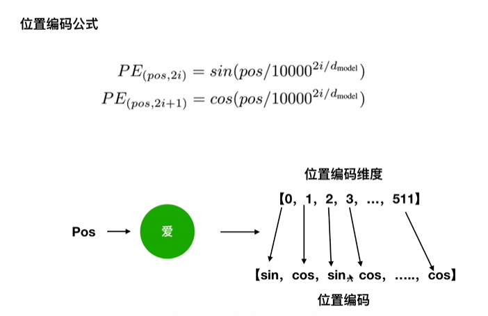

# 第一章

## 1.从全局概括Transformer


**Transformer**是由谷歌于2017年提出的具有里程碑意义的模型，同时也是语言AI革命的关键技术。在此之前的SOTA模型都是以循环神经网络为基础（RNN, LSTM等）。从本质上来讲，RNN是以**串行的方式**来处理数据，对应到NLP任务上，即按照句中词语的先后顺序，每一个时间步处理一个词语。

相较于这种串行模式，**Transformer的巨大创新便在于并行化的语言处理**：文本中的所有词语都**可以在同一时间进行分析**，而不是按照序列先后顺序。为了支持这种并行化的处理方式，**Transformer依赖于注意力机制**。注意力机制可以让模型考虑任意两个词语之间的相互关系，且不受它们在文本序列中位置的影响。**通过分析词语之间的两两相互关系，来决定应该对哪些词或短语赋予更多的注意力**。


* *encoder*和*decoder*的结构不同，各*encoder*之间的结构相同但参数不同，同理，各*decoder*之间的结构相同但参数不同。
* 二者的数量可以通过两个超参数来调整
* 在后期有些预训练模型中将*encoder*中某些层的参数进行共享，对*decoder*同理，进而达到减少参数量的目的
  <br>

## 2.位置编码的作用

* 对于**RNN**的不同*time steps*，都共享一套参数，即输入参数、输出参数、隐层参数等
* **RNN**与普通网络的**梯度消失**并不同，它的梯度消失是一个总和，总梯度被近距离梯度主导，而由于不同时间步之间参数共享，进而远距离的梯度往往出现在一长串的连乘之中，故远距离梯度可能被大幅度减小或者方法，进而引出**RNN**的梯度消失和梯度爆炸问题
* ***batch normalization***一般无法运用在**RNN**中，因为归一化是“垂直”应用的，即每个时间步上**RNN**的输出。但是**RNN**是水平的，例如在时间步之间，他会因为重复的重新缩放而产生爆炸性的梯度，进而伤害到训练
* ***transformer***与**RNN**不同的地方在于，它是同时处理不同时间步的信息的，可以理解为对N天的股票序列同时处理，但这样肯定会相比**RNN**缺少对序列依赖关系的感知（因为**RNN**是一个一个处理的，可以学习到这种天然的序列或者说前后关系，如NLP中单复数用was/were,股票序列中会不会因为前一天的股价而对今天的股价产生影响等），所以我们需要**位置编码**
* **位置编码**的作用是：
  当我们将一段文本分词并转化为词向量数组时，词的顺序在自然语言中确实扮演着重要的角色。**这是因为在不同的语境下，词语的排列顺序可以传达不同的意义和语义**。这个问题在自然语言处理中被称为“**序列建模**”问题.为了更好地捕捉这种语义信息，我们引入位置编码器。**位置编码器的作用是为词向量添加一些位置相关的信息，以便模型能够区分不同位置的词语。它通过将位置信息与词向量相结合，从而使词向量变得更加丰富和具有上下文感知能力。**
  位置编码器通常**使用正弦和余弦函数等数学函数来生成位置编码。这些编码会根据词在句子中的位置而变化，因此不同位置的词会具有不同的位置编码**。通过将位置编码添加到词向量(**即与embedding相加**)中，模型可以区分不同位置的词，从而更好地理解文本的语义。（**故：位置编码维度应与embedding维度相同**）
  
  

<div align="center"> <strong>其中pos为位置编码中的不同位置</strong> </div><br>


<div align="center"> <strong>将经由sin/cos计算所得位置编码与embedding相加，得到最终的输入embedding</strong> </div>

## 3.多头注意力机制

* 注意力机制公式：


* 注意力机制必须要有**Q K V**三个向量或矩阵，下图为注意力机制结构


* **F（Q，K)代表两向量点乘或矩阵相乘，向量点乘代表两个向量逐个元素相乘再相加，也可以代表一个向量在另一个向量上的投影，两个向量越相似，则两个向量的点乘就应该越大**，这也是毕设中GCN的设计思路
* 通过softmax的激活值a1-4，再分别与V1-4相乘后再相加，即softmax所得出的向量与向量V点乘，得出最后的***Attention Value***
  
  

<div align="center"> <strong>如何获取KQV三个向量/矩阵</strong> </div><br>

* 例如在NLP中，Thinking对应的**embedding**为 X<sub>1</sub>,将其分别与 *W<sub>Q</sub>*、*W<sub>K</sub>*、*W<sub>V</sub>* 相乘然后获得**Q K V**三个向量,再将其带入到缩放点积公式中进行计算
* 注意：**如果Q＝K＝V**，即上述*W<sub>Q</sub>*、*W<sub>K</sub>*、*W<sub>V</sub>* 相同，那么这就是自注意力机制***self attention***
  <br>
  
  
  

<div align="center"> <strong>计算过程实例</strong> </div><br>

* 为何除以$\sqrt{dk}$:
  1.具体来说，在计算注意力得分时，通常会使用一个**相似性度量函数来衡量输入序列中不同位置之间的相似程度(即Q✖K<sup>T</sup>)**。这个相似性度量函数的**输出值**通常会受到**输入序列的长度和特征维度的影响**。
  2.通过除以$\sqrt{dk}$力得分可以**将注意力得分的尺度归一化到一个相对稳定的范围内**，使得不同位置和维度的注意力得分具有可比性。这样可以确保在进行后续的softmax 操作或其他与注意力得分相关的计算时，不同位置的注意力得分**不会因为输入序列的长度或特征维度的变化而产生过大的差异,且不会因为Q*K<sup>T</sup>数值过大而落入softmax的小梯度区间进而造成梯度消失**。
  3.此外，除以$\sqrt{dk}$还可以在一定程度上**减轻由于输入序列长度和特征维度的增加而导致的数值不稳定性问题**。这样可以提高模型的训练稳定性和泛化能力。
  <br>
* 为何除以$\sqrt{dk}$而不是*dk*: **原始表征是符合均值N(0,1)的，而与权重矩阵相乘后，结果符合N(0,dk)的正态分布了，所以为了不改变原始表征的分布，需要除以$\sqrt{dk}$。**这可以更好地控制数值的量级,使得注意力得分在不同的位置和维度上具有相对统一的分布，恒为N（0，1），有助于**避免数值溢出或下溢的问题**，提高计算的稳定性。
  
  

<div align="center"> <strong>实际代码使用矩阵</strong> </div><br>

* 图中X可以理解为**上图thinking和machines所对应的embedding拼接到一起,通过X与三个不同的针对性权重矩阵相乘得出Q K V三个矩阵**
* **三个矩阵的维度可以用权重矩阵来控制,三个矩阵的值可以随机初始化,而dimension是自己规定的**
* 1.由于X为所有embedding拼接到一起，**所以才所说它是同时处理不同时间步的信息的：它可以同时看到不同的embedding，而不是像RNN或者LSTM那样一次只能看到一个或者n个embedding,要经历多个时间步才能看完**。
  2.可以理解为：**毕设中，单只股票每天embedding的deminsion为[1✖5]，将N天的emdedding拼接到一起形成一个大的X，deminsion为[N✖5]，再输入到tranformer中，对N天的股票序列同时处理.**
  3.这有助于理解下文Decoder中的***Mask Muti-head Attention***
* Q✖K<sup>T</sup>代表了**相似性度量函数,可以得出相似度得分**,进而归一化后通过softmax与**V**相乘得出注意力得分**Attention value**
* 得出**Attention value**的过程被叫做**缩放点积模型**，具体请参考([试图带你一文搞懂transformer注意力机制（Self-Attention）的本质\_transformer中attention(q,k,v)的本质事什么-CSDN博客](https://blog.csdn.net/athrunsunny/article/details/133780978))（网址：https://blog.csdn.net/athrunsunny/article/details/133780978）
  <br>
  
  
  
  
  

<div align="center"> <strong>多头注意力机制</strong> </div><br>

* **多头注意力机制**:
  1.使用**多套计算Q K V的针对性权重矩阵,通过此种方法计算出不同的Z**.
  2.**Concatenate所有的Z<sub>i</sub>矩阵，然后乘以一个权重矩阵W<sup>O</sup>**（随机初始化所得）,最终计算所得一个矩阵Z，作为多头注意力部分的输出
  <br>
* 使用多头注意力机制具有**以下几点好处**:

1. ​**多角度信息融合​**：***多头注意力机制通过多个头（多个独立的注意力子机制）来处理输入序列，每个头可以关注输入序列的不同子空间或特征表示。这样可以捕捉到输入序列中的多种信息，从而提供更全面和丰富的表示。(more important)***
2. ​**增强模型的灵活性和适应性**​：不同的头可以学习到不同的注意力模式和特征，从而增强了模型对不同任务和数据的适应性。模型可以根据输入的特征和任务需求，灵活地调整不同头的权重和关注重点。
3. ​**提高模型的容量和表达能力**​：多个头的设计增加了模型的参数量和计算量，从而提高了模型的容量和表达能力。这使得模型能够处理更复杂的任务和学习更复杂的模式。
4. ​**并行处理和效率提升**​：***多头注意力机制可以在不同的头之间进行并行计算，提高了计算效率。这对于处理大规模数据和需要实时响应的任务非常重要。(more important)***
5. ​**捕获长距离依赖关系**​：通过多个头的协同作用，**多头注意力机制能够更好地捕捉输入序列中的长距离依赖关系**。这对于处理自然语言等具有长序列结构的任务非常有益。
6. ​**增强模型的鲁棒性**​：多个头的设计可以在一定程度上减轻过拟合的风险，因为不同的头可以学习到不同的模式和特征，从而增加了模型的鲁棒性。

* **注意力机制的缺点**：没法捕捉位置信息，即没法学习序列中的顺序关系。这点可以通过加入位置信息，如通过位置向量来改善，具体如bert模型。

## 4.残差网络Resnet为何可以减弱梯度消失


<div align="center"> <strong>残差网络与梯度反向传播链式法则公式</strong> </div>
<br>

* 可以看到，这是一个残差块且长度为2，A的输出要与C的输出相加，再作为输入数据进入D。根据链式求导法则，可与推导出损失函数L对 *X<sub>Aout</sub>* 的求导公式，我们知道，**梯度消失往往因为许多小于1的梯度进行连乘，进而导致结果x无限接近于0，模型无法有效更新参数。而残差网络Resnet将两步之前的输出与当前的输出相加再输入到下一步长中，所以在求导公式中会出现1+x的这种形式，这样保证了其不会等于0，而是在1的邻域内，所以可以有效避免梯度消失**.

## 5.为什么在transformer中不使用Batch normalization而使用layer normalization

* **BN的优点**：
  1.**解决内部协变量偏移**：各隐藏层的输出作为下一层的输入，**而不同隐藏层的输出具有不同的分布**，这样就增大了学习难度。使用BN可以**人为的使用两个超参数α、β来让不同隐藏层的输出在同一分布上（正态分布，先将输出值标准正态化为N（0，1），再让其乘以α后加上β，这样原来的数据就被正态化为N（β，α<sup>2</sup>））,如此保证了前层不会左右移动的太多**.
  2.缓解梯度饱和问题：若超参数α，β选择适当，可以有效加快收敛，加快模型训练速度（参考feature scaling）。
* BN的缺点：
  1.由于**BN是基于mini_batch的，当batch_size比较小的时候，我们需要用一个较小的局部样本的均值和方差来模拟整个样本的均值和方差**，来训练模型和更新参数，所以可能让模型学习到噪音，进而减缓模型收敛速度。
  2.BN一般无法运用在**RNN**中，因为归一化是“垂直”应用的，即每个时间步上**RNN**的输出。但是**RNN是水平的，输入是动态的**，它会因为重复的重新缩放而产生爆炸性的梯度，进而伤害到训练（可以理解为毕设中对每支股票再某一时间步上输出的激活值进行归一化后再输入到下一时间步上与下一时间步的输入进行计算）
* 使用LN而不是BN的原因：输入序列的长度问题。在NLP中，我们无法要求每一个序列的长度相同；在CV中，虽然特征会经过padding处理而达到同意的维度，但是padding的0值其实是无用信息，实际上有用的信息还是序列信息，而不同序列的长度不同，所以这里不能使用bn一概而论

## 6.Encoder结构详解


<div align="center"> <strong>Encoder三个组成部分示意图1</strong> </div>
<br>


<div align="center"> <strong>Encoder三个组成部分示意图2</strong> </div>
<br>

* **输入部分**：将输入的token embedding，记为*X<sub>0</sub>*，与上文方法所得位置编码positional embedding(**偶数位置用正弦，技术位置用余弦**）相加，得出新的输入embedding作为下一步输入，记为*X<sub>1</sub>*
* **多头注意力机制部分**：先将*X<sub>1</sub>* 输入到缩放点积注意力模型中，且应用多头注意力***muti-head attention***，通过多套且三个不同的针对性权重矩阵计算出*Q<sub>i</sub>*，*K<sub>i</sub>*，*V<sub>i</sub>* 三个矩阵(i代表套数，即muti-head中的头数)，进而计算出不同的*Z<sub>i</sub>* . 然后使用resnet残差网络的思想，将 *X<sub>1</sub>* 与所得各*Z<sub>i</sub>* 相加，且通过层归一化layer normalization(LN),得出注意力机制部分的输出，将此操作记为***res+LN***,所得输出记为*Z’<sub>i</sub>*
* **前馈神经网络部分**：
  1.简单的将上一部分所得*Z‘<sub>i</sub>* 输入全连接层进行向前传播，再通过一个***res+LN***操作，得到此Encoder的输出,记为*Z“<sub>i</sub>*
  2.全连接层公式：**w<sub>2</sub>✖[relu(w<sub>1</sub>✖x+b<sub>1</sub>)]+b<sub>2</sub>**,这里使用FFN层的原因是：为了使用非线性函数来拟合数据。如果说只是为了非线性拟合的话，其实只用到第一层就可以了，**但是这里为什么要用两层全连接呢? 使用第二层全连接层是为了进行维度变换**
* **Encoder不改变数据的格式，输入和输出的格式相同**，下面为具体例子：
  
  

## 7.Decoder结构详解


<div align="center"> <strong>Decoder四个组成部分示意图</strong> </div>
<br>

* **遮盖注意力机制**：它的作用就是**防止在训练的时候使用未来的输出的单词**。比如训练时，**第一个单词是不能参考第二个单词的生成结果的，此时就会将第二个单词及其之后的单词都mask掉**。总体来讲，mask的作用就是用来**保证预测位置i的信息只能基于比i小的输出**。因此，**encoder层可以并行计算，一次全部encoding出来，但是decoder层却一定要像RNN一样一个一个解出来，因为要用上一个位置的输入当做attention的Q矩阵**.
* 遮盖注意力机制简单举例：
  
  
  
  
* 假设在NLP的文本预测领域，矩阵上方为句子预测结果，下方为训练时Decoder的有序输入，当我们输入到LOVE的时候，模型应当输出YOU。
* 若不使用遮盖机制，则形如图片上半，模型在训练中，**基于muti-attention并行输入机制，YOU的输出预测是会受到输入中LOVE后面YOU和NOW影响，二者都会给YOU的预测提供信息。而在验证和测试过程中，模型是无法并行知道全部的输入的，即：训练看得到后续，而验证预测看不到后续**
* 使用遮盖机制之后，模型在训练时也看不到后续的输出。形如图片下半部分，我们不让输入中的YOU和LOVE为YOU的输出预测提供信息。如此操作，我们就很好的消除了模型在训练和验证测试阶段的gap。
* Decoder最后使用一个FC（Full connection,即全连接）的linear层进行输出，不使用激活函数，但却不使用单纯的dense层（FC层）进行输出的原因，在于损失方式CrossEntropy：该损失函数集成了log_softmax和nll_loss。因此，相当于FC层后接上CrossEntropy，实际上是有经过softmax处理的。只是内置到损失函数CrossEntropy中去了。

## 8.Encoder和Decoder的消息传递机制


* 需要注意的是：最后一个Encoder的输出为Z(由Concatenate多头注意力输出的Z<sub>i</sub>后乘以权重矩阵W<sup>O</sup>，再通过前馈神经网络的两层全连接层后输出到下一Encoder，如此循环N次得出最后一个Encoder的输出Z)，尤其计算出的K和V矩阵，输入到每个Decoder中作为多头注意力机制中的K，V矩阵，而Decoder中的Q矩阵则是由自我的输入得出，即**Decoder的Muti-attention中，K，V由最后一个Encoder的输出Z计算所得，Q来自自身**。

## 9.完整模型细节展示


## 10.基于Pytorch的Transformer源码实现

```
"""
!pip install
http://download.pytorch.org/whl/cu80/torch-0.3.0.post4-cp36-cp36m-linux\_x86\_64.whl
numpy matplotlib spacy torchtext seaborn
"""

import os
from os.path import exists
import torch
import torch.nn as nn
from torch.nn.functional import log_softmax, pad
import math
import copy
import time
from torch.optim.lr_scheduler import LambdaLR
import pandas as pd
import altair as alt
from torchtext.data.functional import to_map_style_dataset
from torch.utils.data import DataLoader
from torchtext.vocab import build_vocab_from_iterator
import torchtext.datasets as datasets
import spacy
import GPUtil
import warnings
from torch.utils.data.distributed import DistributedSampler
import torch.distributed as dist
import torch.multiprocessing as mp
from torch.nn.parallel import DistributedDataParallel as DDP

# Set to False to skip notebook execution (e.g. for debugging)

warnings.filterwarnings("ignore")
RUN_EXAMPLES = True


class EncoderDecoder(nn.Module):
"""
A standard Encoder-Decoder architecture. Base for this and many
other models.
"""
def __init__(self, encoder, decoder, src_embed, tgt_embed, generator):
super(EncoderDecoder, self).__init__()
self.encoder = encoder
self.decoder = decoder
self.src_embed = src_embed
self.tgt_embed = tgt_embed
self.generator = generator

def forward(self, src, tgt, src_mask, tgt_mask):
"Take in and process masked src and target sequences."
return self.decode(self.encode(src, src_mask), src_mask, tgt, tgt_mask)

def encode(self, src, src_mask):
return self.encoder(self.src_embed(src), src_mask)

def decode(self, memory, src_mask, tgt, tgt_mask):
return self.decoder(self.tgt_embed(tgt), memory, src_mask, tgt_mask)


class Generator(nn.Module):
"Define standard linear + softmax generation step."
def __init__(self, d_model, vocab):
super(Generator, self).__init__()
self.proj = nn.Linear(d_model, vocab)

def forward(self, x):
return log_softmax(self.proj(x), dim=-1)

def clones(module, N):
    "Produce N identical layers."
    return nn.ModuleList([copy.deepcopy(module) for _ in range(N)])


class Encoder(nn.Module):
    "Core encoder is a stack of N layers"
    def __init__(self, layer, N):
        super(Encoder, self).__init__()
        self.layers = clones(layer, N)
        self.norm = LayerNorm(layer.size)
   "Pass the input (and mask) through each layer in turn."
    def forward(self, x, mask):
        for layer in self.layers:
            x = layer(x, mask)
        return self.norm(x)


class EncoderLayer(nn.Module):
    "Encoder is made up of self-attn and feed forward (defined below)"

    def __init__(self, size, self_attn, feed_forward, dropout):
        super(EncoderLayer, self).__init__()
        self.self_attn = self_attn
        self.feed_forward = feed_forward
        self.sublayer = clones(SublayerConnection(size, dropout), 2)
        self.size = size

    def forward(self, x, mask):
        "Follow Figure 1 (left) for connections."
        x = self.sublayer[0](x, lambda x: self.self_attn(x, x, x, mask))
        return self.sublayer[1](x, self.feed_forward)


class LayerNorm(nn.Module):
    "Construct a layernorm module (See citation for details)."
    def __init__(self, features, eps=1e-6):
        super(LayerNorm, self).__init__()
        self.a_2 = nn.Parameter(torch.ones(features))
        self.b_2 = nn.Parameter(torch.zeros(features))
        self.eps = eps

    def forward(self, x):
        mean = x.mean(-1, keepdim=True)
        std = x.std(-1, keepdim=True)
        return self.a_2 * (x - mean) / (std + self.eps) + self.b_2


class SublayerConnection(nn.Module):
    """
    A residual connection followed by a layer norm.
    Note for code simplicity the norm is first as opposed to last.
    """

    def __init__(self, size, dropout):
        super(SublayerConnection, self).__init__()
        self.norm = LayerNorm(size)
        self.dropout = nn.Dropout(dropout)

    def forward(self, x, sublayer):
        "Apply residual connection to any sublayer with the same size."
        return x + self.dropout(sublayer(self.norm(x)))


class Decoder(nn.Module):
    "Generic N layer decoder with masking."

    def __init__(self, layer, N):
        super(Decoder, self).__init__()
        self.layers = clones(layer, N)
        self.norm = LayerNorm(layer.size)

    def forward(self, x, memory, src_mask, tgt_mask):
        for layer in self.layers:
            x = layer(x, memory, src_mask, tgt_mask)
        return self.norm(x)


class DecoderLayer(nn.Module):
    "Decoder is made of self-attn, src-attn, and feed forward (defined below)"

    def __init__(self, size, self_attn, src_attn, feed_forward, dropout):
        super(DecoderLayer, self).__init__()
        self.size = size
        self.self_attn = self_attn
        self.src_attn = src_attn
        self.feed_forward = feed_forward
        self.sublayer = clones(SublayerConnection(size, dropout), 3)

    def forward(self, x, memory, src_mask, tgt_mask):
        "Follow Figure 1 (right) for connections."
        m = memory
        x = self.sublayer[0](x, lambda x: self.self_attn(x, x, x, tgt_mask))
        x = self.sublayer[1](x, lambda x: self.src_attn(x, m, m, src_mask))
        return self.sublayer[2](x, self.feed_forward)


def subsequent_mask(size):
"Mask out subsequent positions."
attn_shape = (1, size, size)
subsequent_mask = torch.triu(torch.ones(attn_shape), diagonal=1).type(
torch.uint8
)
return subsequent_mask == 0


def attention(query, key, value, mask=None, dropout=None):
"Compute 'Scaled Dot Product Attention'"
d_k = query.size(-1)
scores = torch.matmul(query, key.transpose(-2, -1)) / math.sqrt(d_k)
if mask is not None:
scores = scores.masked_fill(mask == 0, -1e9)
p_attn = scores.softmax(dim=-1)
if dropout is not None:
p_attn = dropout(p_attn)
return torch.matmul(p_attn, value), p_attn


class MultiHeadedAttention(nn.Module):
    def __init__(self, h, d_model, dropout=0.1):
        "Take in model size and number of heads."
        super(MultiHeadedAttention, self).__init__()
        assert d_model % h == 0
        # We assume d_v always equals d_k
        self.d_k = d_model // h
        self.h = h
        self.linears = clones(nn.Linear(d_model, d_model), 4)
        self.attn = None
        self.dropout = nn.Dropout(p=dropout)

    def forward(self, query, key, value, mask=None):
        "Implements Figure 2"
        if mask is not None:
            # Same mask applied to all h heads.
            mask = mask.unsqueeze(1)
        nbatches = query.size(0)

        # 1) Do all the linear projections in batch from d_model => h x d_k
        query, key, value = [
            lin(x).view(nbatches, -1, self.h, self.d_k).transpose(1, 2)
            for lin, x in zip(self.linears, (query, key, value))
        ]

        # 2) Apply attention on all the projected vectors in batch.
        x, self.attn = attention(
            query, key, value, mask=mask, dropout=self.dropout
        )

        # 3) "Concat" using a view and apply a final linear.
        x = (
            x.transpose(1, 2)
            .contiguous()
            .view(nbatches, -1, self.h * self.d_k)
        )
        del query
        del key
        del value
        return self.linears[-1](x)


class PositionwiseFeedForward(nn.Module):
    "Implements FFN equation."

    def __init__(self, d_model, d_ff, dropout=0.1):
        super(PositionwiseFeedForward, self).__init__()
        self.w_1 = nn.Linear(d_model, d_ff)
        self.w_2 = nn.Linear(d_ff, d_model)
        self.dropout = nn.Dropout(dropout)

    def forward(self, x):
        return self.w_2(self.dropout(self.w_1(x).relu()))


class Embeddings(nn.Module):
    def __init__(self, d_model, vocab):
        super(Embeddings, self).__init__()
        self.lut = nn.Embedding(vocab, d_model)
        self.d_model = d_model

    def forward(self, x):
        return self.lut(x) * math.sqrt(self.d_model)


class PositionalEncoding(nn.Module):
    "Implement the PE function."

    def __init__(self, d_model, dropout, max_len=5000):
        super(PositionalEncoding, self).__init__()
        self.dropout = nn.Dropout(p=dropout)

        # Compute the positional encodings once in log space.
        pe = torch.zeros(max_len, d_model)
        position = torch.arange(0, max_len).unsqueeze(1)
        div_term = torch.exp(
            torch.arange(0, d_model, 2) * -(math.log(10000.0) / d_model)
        )
        pe[:, 0::2] = torch.sin(position * div_term)
        pe[:, 1::2] = torch.cos(position * div_term)
        pe = pe.unsqueeze(0)
        self.register_buffer("pe", pe)

    def forward(self, x):
        x = x + self.pe[:, : x.size(1)].requires_grad_(False)
        return self.dropout(x)


def make_model(
    src_vocab, tgt_vocab, N=6, d_model=512, d_ff=2048, h=8, dropout=0.1
):
    "Helper: Construct a model from hyperparameters."
    c = copy.deepcopy
    attn = MultiHeadedAttention(h, d_model)
    ff = PositionwiseFeedForward(d_model, d_ff, dropout)
    position = PositionalEncoding(d_model, dropout)
    model = EncoderDecoder(
        Encoder(EncoderLayer(d_model, c(attn), c(ff), dropout), N),
        Decoder(DecoderLayer(d_model, c(attn), c(attn), c(ff), dropout), N),
        nn.Sequential(Embeddings(d_model, src_vocab), c(position)),
        nn.Sequential(Embeddings(d_model, tgt_vocab), c(position)),
        Generator(d_model, tgt_vocab),
    )

    # This was important from their code.
    # Initialize parameters with Glorot / fan_avg.
    for p in model.parameters():
        if p.dim() > 1:
            nn.init.xavier_uniform_(p)
    return model


# small example model.
temp_model=make_modlel(10,10,2)
None
```

